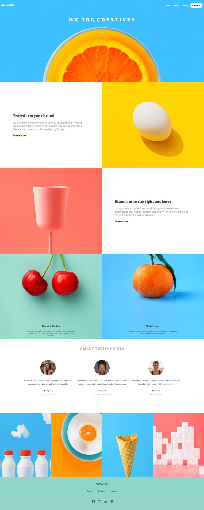
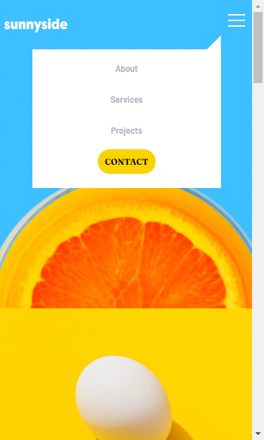

# Frontend Mentor - Sunnyside agency landing page solution

This is a solution to the [Sunnyside agency landing page challenge on Frontend Mentor](https://www.frontendmentor.io/challenges/sunnyside-agency-landing-page-7yVs3B6ef)

## Table of contents

- [Overview](#overview)
  - [The challenge](#the-challenge)
  - [Screenshot](#screenshot)
  - [Links](#links)
- [My process](#my-process)
  - [Built with](#built-with)
  - [What I learned](#what-i-learned)
  - [Continued development](#continued-development)
  - [Useful resources](#useful-resources)
- [Author](#author)
- [Acknowledgments](#acknowledgments)


## Overview

### The challenge

Users should be able to:

- View the optimal layout for the site depending on their device's screen size
- See hover states for all interactive elements on the page

### Screenshot





### Links

- Source Code: [Files and Code of sunnyside landing page](https://github.com/Sunilprasadk/sunilprasadk.github.io/tree/main/frontendmentorchallenges/sunnyside-agency-landing-page-main)
- Website: [sunnyside Agency Landing Page](https://sunilprasadk.github.io/frontendmentorchallenges/sunnyside-agency-landing-page-main/)

## My process

### Built with

- Semantic HTML5 markup
- CSS custom properties
- Flexbox
- Desktop first workflow

### What I learned
- Designing the top header with the title text "WE ARE CREATIVES" & that background image "image-header" perfectly was hard to me. I tried with viewport height but it doesn't work perfectly for mobile phones with higher viewport height. The title with the dropdown arrow is not fit properly for those devices. But the alternative approach helped me to achieve that. The code snippet below,

```css
.header{
  background-image: url("../images/desktop/image-header.jpg");
  padding-bottom:20rem;
  background-size: cover;
  background-position: bottom;
  background-repeat: no-repeat;
}
```

- In Mobile devices, the placement of text over the image was a challenge to me. I finally finded a way to get the perfect design. The code snippet below,

```css
@media(max-width:37.5rem){
  .service_image.service_image-special{
    width:100%;
    height:30rem;
  }
}
```


### Continued development

- I have to focus on the reusable code writing and also to adopt modern technologies & practices.


### Useful resources

- [Responsive Images](https://developer.mozilla.org/en-US/docs/Learn/HTML/Multimedia_and_embedding/Responsive_images) - This is an amazing article which helped me to know and how to implement responsive images in html and css.
- [CSS code for different browsers](https://autoprefixer.github.io/) - This website helped me to get a different css codes for a certain property to work in major browsers.


## Author

- GitHub Profile - [Sunilprasad Kuppusamy](https://github.com/Sunilprasadk/sunilprasadk.github.io)
- Frontend Mentor - [@Sunilprasadk](https://www.frontendmentor.io/profile/Sunilprasadk)


## Acknowledgments

I want to thank the resources (websites with tutorial, blogs and videos) out there in Google and also the developers who have provided their contribution over there. Thanks a lot.

