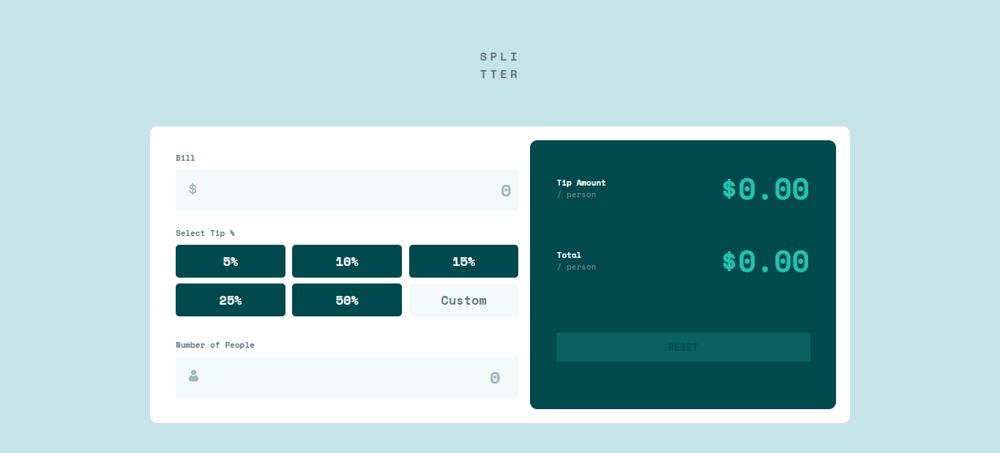

# Frontend Mentor - Tip calculator app solution

This is a solution to the [Tip calculator app challenge on Frontend Mentor](https://www.frontendmentor.io/challenges/tip-calculator-app-ugJNGbJUX). Frontend Mentor challenges help you improve your coding skills by building realistic projects.

## Table of contents

- [Overview](#overview)
  - [The challenge](#the-challenge)
  - [Screenshot](#screenshot)
  - [Links](#links)
- [My process](#my-process)
  - [Built with](#built-with)
  - [What I learned](#what-i-learned)
  - [Continued development](#continued-development)
  - [Useful resources](#useful-resources)
- [Author](#author)
- [Acknowledgments](#acknowledgments)


## Overview

- I actually searched for the project to improve my JavaScript skills. Then, I find this project which helped me to test my knowledge in JavaScript. I learned a lot of things from this project.

### The challenge

Users should be able to:

- View the optimal layout for the app depending on their device's screen size
- See hover states for all interactive elements on the page
- Calculate the correct tip and total cost of the bill per person

- I CROSSED THE ABOVE CHALLENGES

### Screenshot


.png)
.png)
.png)

### Links

- Solution URL: [Add solution URL here](https://your-solution-url.com)
- Live Site URL: [Add live site URL here](https://your-live-site-url.com)

## My process

### Built with

- Semantic HTML5 markup
- CSS custom properties
- Flexbox
- Desktop-First workflow


### What I learned

During this project, I learned that Creating projects helped us to get more knowledge than just listening the tutorials. In this project, I solved many problems. It Helped me to learn more on JavaScript. Some of the code snippets, which make me happy - see below:

```js
if(customValue===""){
        tipAmountResult = ((parseFloat(billValue) * parseFloat(tipPercent/100)) / parseInt(numberOfPeople)).toFixed(2);
        totalAmountResult = ((parseFloat(billValue) / parseInt(numberOfPeople)) + parseFloat(tipAmountResult)).toFixed(2);
        if(billValue==="" || numberOfPeople==="" || tipPercent===""){
            tipAmount.innerHTML = `$0.00`;
            Total.innerHTML = `$0.00`;
        }else{
            tipAmount.innerHTML = `$ ${tipAmountResult}`;
            Total.innerHTML = `$ ${totalAmountResult}`;
        }
    }else{
        tipAmountResult = ((parseFloat(billValue) * parseFloat(customValue/100)) / parseInt(numberOfPeople)).toFixed(2);
        totalAmountResult = ((parseFloat(billValue) / parseInt(numberOfPeople)) + parseFloat(tipAmountResult)).toFixed(2);
        if(billValue==="" || numberOfPeople==="" || customValue===""){
            tipAmount.innerHTML = `$0.00`;
            Total.innerHTML = `$0.00`;
        }else{
            tipAmount.innerHTML = `$ ${tipAmountResult}`;
            Total.innerHTML = `$ ${totalAmountResult}`;
        }
    }
```

### Continued development

I have to focus more on JavaScript skills.


### Useful resources

- [CSS code for different browsers](https://autoprefixer.github.io/) - This website helped me to get a different css codes for a certain property to work in major browsers.


## Author

- GitHub Profile - [Sunilprasad Kuppusamy](https://github.com/Sunilprasadk/sunilprasadk.github.io)
- Frontend Mentor - [@Sunilprasadk](https://www.frontendmentor.io/profile/Sunilprasadk)


## Acknowledgments

I want to thank the resources (websites with tutorial, blogs and videos) out there in Google and also the developers who have provided their contribution over there. Thanks a lot.
